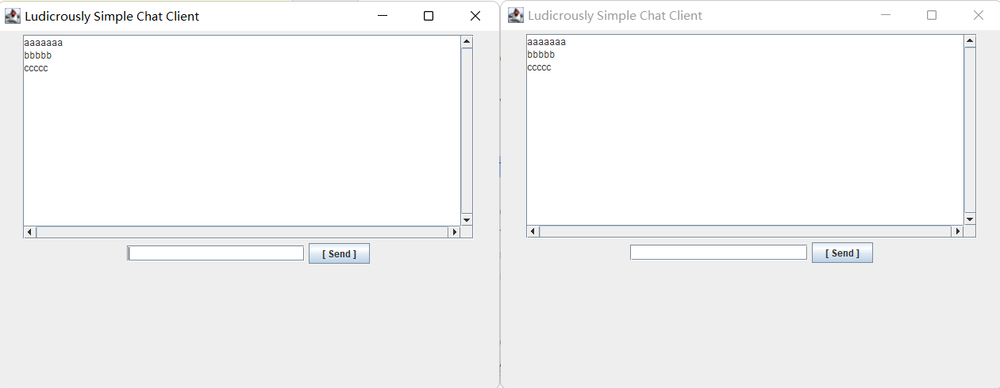

# SimpleChat

# 一、简介

简易聊天室，java版，有简易GUI

# 二、部署

两个.java放在chap15second软件包即可，或者你改下它们头部的包名

先运行server，在运行client（可以运行多个）

# 三、运行截图

# 四、总结

## （一）java网络编程

套接字使用TCP提供了两台计算机之间的通信机制。 客户端程序创建一个套接字，并尝试连接服务器的套接字。

当连接建立时，服务器会创建一个 Socket 对象。客户端和服务器现在可以通过对 Socket 对象的写入和读取来进行通信。

java.net.Socket 类代表一个套接字，并且 java.net.ServerSocket 类为服务器程序提供了一种来监听客户端，并与他们建立连接的机制。

以下步骤在两台计算机之间使用套接字建立TCP连接时会出现：

* 服务器实例化一个 ServerSocket 对象，表示通过服务器上的端口通信。

* 服务器调用 ServerSocket 类的 accept() 方法，该方法将一直等待，直到客户端连接到服务器上给定的端口。

* 服务器正在等待时，一个客户端实例化一个 Socket 对象，指定服务器名称和端口号来请求连接。

* Socket 类的构造函数试图将客户端连接到指定的服务器和端口号。如果通信被建立，则在客户端创建一个 Socket 对象能够与服务器进行通信。

* 在服务器端，accept() 方法返回服务器上一个新的 socket 引用，该 socket 连接到客户端的 socket。

连接建立后，通过使用 I/O 流在进行通信，每一个socket都有一个输出流和一个输入流，客户端的输出流连接到服务器端的输入流，而客户端的输入流连接到服务器端的输出流。

## （二）异常

Exception 类是 Throwable 类的子类。除了Exception类外，Throwable还有一个子类Error 。

异常类有两个主要的子类：IOException 类和 RuntimeException 类。
